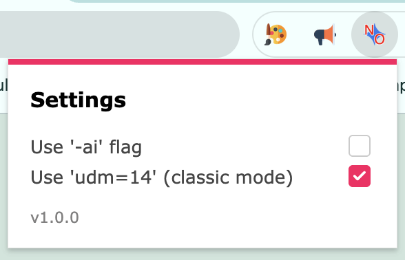

## no-ai-overview

This is a chrome extension removes google's AI overview. Specifically, it makes the browser add some parameters to your web request so that the AI doesn't get prompted. :D

More info on making chrome extensions here: [chrome dev docs](https://developer.chrome.com/docs/extensions/get-started/tutorial/hello-world)

## Running This Extension

1. Download the folder "no-ai-overview"
2. Go to chrome://extensions, click "load unpacked", and select the folder. 
3. Click the extension icon in the Chrome toolbar and check a box.